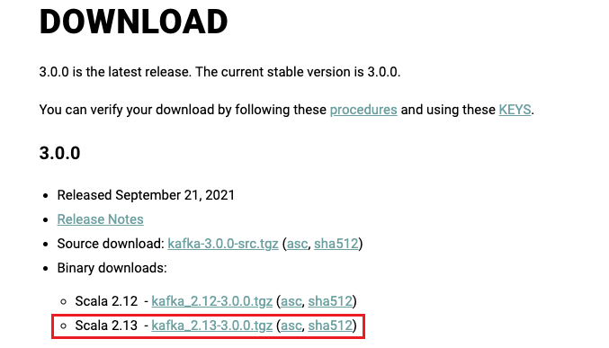
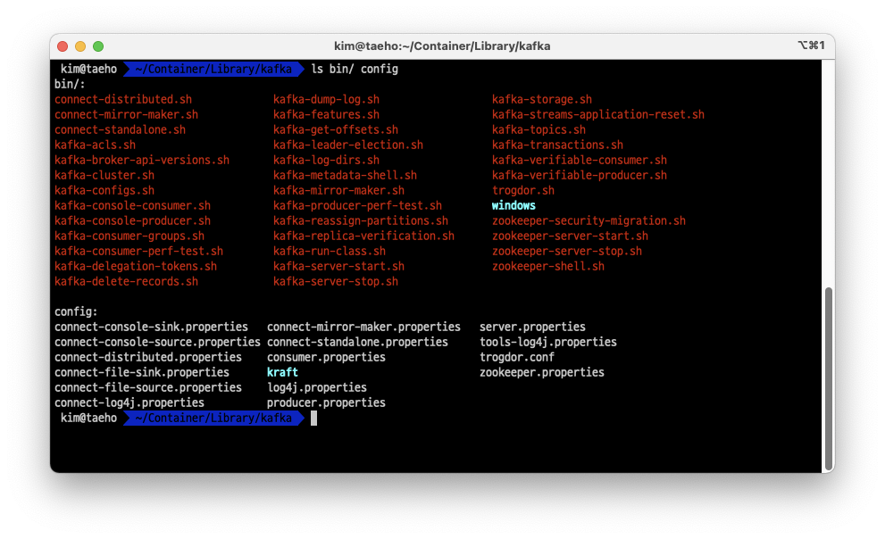
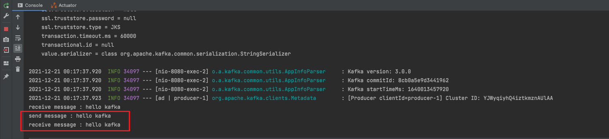
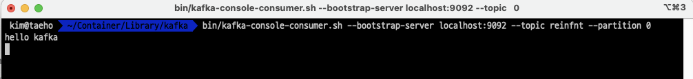

## kafka 다운로드



- 아파치 카프카 공식 홈페이지에서 소스를 다운로드
- [apache-kafka download](https://kafka.apache.org/downloads)

## kafka 설치 및 실행



```shell
bin/zookeeper-server-start.sh config/zookeeper.properties # zokepper

bin/kafka-server-start.sh config/server.properties # kafka
```

- 다운로드 받은 소소를 적당한 곳에 압축해제
- 주키퍼 서버 실행 후 카프카 서버 실행

## topic 생성

```shell
bin/kafka-topics.sh --create --topic reinfnt --replication-factor 1 --partitions 1 --bootstrap-server localhost:9092
```

- 데이터를 주고 받을 topic으로 `reinfnt`라는 이름의 topic을 생성

## 스프링 부트 설정 (application.yml)

```yml
spring:
  kafka:
    consumer:
      bootstrap-servers: localhost:9092
      group-id: reinfnt
      auto-offset-reset: earliest
      key-deserializer: org.apache.kafka.common.serialization.StringDeserializer
      value-deserializer: org.apache.kafka.common.serialization.StringDeserializer
    producer:
      bootstrap-servers: localhost:9092
      key-serializer: org.apache.kafka.common.serialization.StringSerializer
      value-serializer: org.apache.kafka.common.serialization.StringSerializer
```

- 스프링부트 애플리케이션에서 kafka의 producer, consumer 역할을 모두 수행하도록 설정

## Producer 코드 작성

```java
package com.reinfnt.springkafkatutorial.service;

import org.springframework.kafka.core.KafkaTemplate;
import org.springframework.stereotype.Service;

@Service
public class KafkaProducerService {

    private KafkaTemplate<String, String> kafkaTemplate;

    public KafkaProducerService(KafkaTemplate<String, String> kafkaTemplate) {
        this.kafkaTemplate = kafkaTemplate;
    }

    public void sendMessage(String message) {
        System.out.println("send message : " + message);
        this.kafkaTemplate.send("reinfnt", message);
    }
}
```

- 카프카 브로커의 특정 토픽으로 **데이터를 전송**
- 예제에서는 전달받은 메시지를 'reinfnt' 토픽으로 전송한다.

## Consumer 코드 작성

```java
package com.reinfnt.springkafkatutorial.service;

import org.springframework.kafka.annotation.KafkaListener;
import org.springframework.stereotype.Service;

import java.io.IOException;

@Service
public class KafkaConsumerService {

    @KafkaListener(topics = "reinfnt", groupId = "reinfnt")
    public void consume(String message) throws IOException {
        System.out.println("receive message : " + message);
    }
}
```

- 카프카 브로커의 특정 토픽에서 **데이터를 소비**
- 예제에서는 'reinfnt' 토픽으로 전달받은 메시지를 소비한다. 

## 메시지 전송


- 스프링 부트 서버 실행
- KafkaProducerController.sendMessage로 메시지 전송

## 메시지 확인



- send message : kafka producer가 보낸 메시지
- receive message : kafka consumer가 소비한 메시지



- 서버에서 확인한 kafka consumer