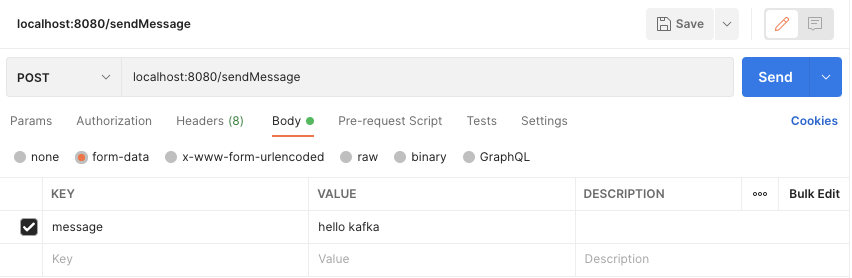

## kafka 다운로드

[apache-kafka download](https://kafka.apache.org/downloads)


- 아파치 카프카 공식 홈페이지에서 소스를 다운로드

## kafka 설치 및 실행


```shell
bin/zookeeper-server-start.sh config/zookeeper.properties # zokepper

bin/kafka-server-start.sh config/server.properties # kafka
```

- 다운로드 받은 소소를 적당한 곳에 압축해제
- 주키퍼 서버 실행 후 카프카 서버 실행

## topic 생성

```shell
bin/kafka-topics.sh --create --topic reinfnt --replication-factor 1 --partitions 1 --bootstrap-server localhost:9092
```

- reinfnt 토픽 생성

## 메시지 전송



- 스프링 부트 서버 실행
- KafkaProducerController.sendMessage로 메시지 전송

## 메시지 확인


- send message : kafka producer가 보낸 메시지
- receive message : kafka consumer가 소비한 메시지


- 서버에서 확인한 kafka consumer